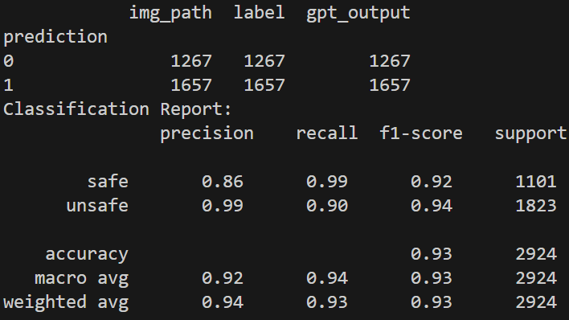

## Artifact Instruction

Here, we offer two scripts for different running environments, researchers can execute any of them to reproduce the results of **UGCG-Guard**.

### GPT4-based UGCG-Guard
To reproduce the results, first make sure that ``base64``, ``requests``, and ``pandas`` are installed in your Python3 environment.

Open the script ``gpt.py`` and offer your OpenAI API key by changing the code in line 11:
```python
# OpenAI API Key
api_key = "YOUR_API_KEY"
```

Testing the whole dataset will take around 10 dollars. You can randomly select a subset with a number of images you want to test by adding a line of code under line 14, such as:
```python
df = pd.read_csv("ugcg.csv") # line 14
# add the following lines of code to test a subset of the image dataset.
df = df.sample(<the number you want>)
```
Then, save the ``gpt.py`` file and simply run it.

After the ``ugcg_gpt.csv`` result file is generated, you can run ``view_result.py`` to visualize the performance.
The output will be like this:




### InstructBLIP-based UGCG-Guard
Please run ``requirements.txt`` to set up your Python environment.

The model we used in this artifact is [InstructBLIP](https://huggingface.co/docs/transformers/en/model_doc/instructblip) from HuggingFace. Note that you may modify the code below to distribute the runing task properly for different GPUs.
```
device_map = infer_auto_device_map(model, max_memory={0: "28GiB", 1: "28GiB"},no_split_module_classes=['InstructBlipVisionModel', 'InstructBlipQFormerModel', 'LlamaDecoderLayer'])
```

Simply run the script ``blip.py``. The results will be automatically stored in ``ugcg_blip.csv``.

## Paper reference

USENIX'24 Submission:

*Moderating Illicit Online Image Promotion for Unsafe User Generated Content Games Using Large Vision-Language Models*

You can find our paper on [arXiv](https://arxiv.org/pdf/2403.18957)

Bibtex:
```
@article{guo2024moderating,
  title={Moderating Illicit Online Image Promotion for Unsafe User-Generated Content Games Using Large Vision-Language Models},
  author={Guo, Keyan and Utkarsh, Ayush and Ding, Wenbo and Ondracek, Isabelle and Zhao, Ziming and Freeman, Guo and Vishwamitra, Nishant and Hu, Hongxin},
  journal={arXiv preprint arXiv:2403.18957},
  year={2024}
}
```

## Artifact License
>MIT License
>
>Copyright (c) 2024 Keyan Guo
>
>Permission is hereby granted, free of charge, to any person obtaining a copy of this software and associated documentation files (the "Software"), to deal in the Software without restriction, including without limitation the rights to use, copy, modify, merge, publish, distribute, sublicense, and/or sell copies of the Software, and to permit persons to whom the Software is furnished to do so, subject to the following conditions:

>The above copyright notice and this permission notice shall be included in all copies or substantial portions of the Software.

>THE SOFTWARE IS PROVIDED "AS IS", WITHOUT WARRANTY OF ANY KIND, EXPRESS OR
IMPLIED, INCLUDING BUT NOT LIMITED TO THE WARRANTIES OF MERCHANTABILITY,
FITNESS FOR A PARTICULAR PURPOSE AND NONINFRINGEMENT. IN NO EVENT SHALL THE
AUTHORS OR COPYRIGHT HOLDERS BE LIABLE FOR ANY CLAIM, DAMAGES OR OTHER
LIABILITY, WHETHER IN AN ACTION OF CONTRACT, TORT OR OTHERWISE, ARISING FROM, OUT OF OR IN CONNECTION WITH THE SOFTWARE OR THE USE OR OTHER DEALINGS IN THE SOFTWARE.